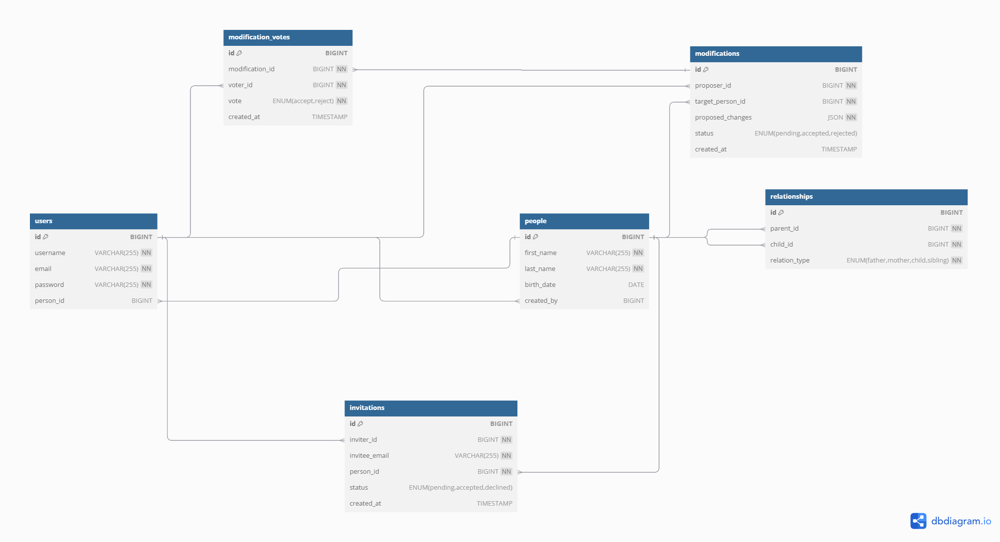

# 📖 Base de Données Généalogique

Ce projet définit une base de données pour un site de généalogie où les utilisateurs peuvent ajouter des membres de leur famille, établir des relations de parenté et proposer des modifications qui doivent être validées par la communauté.

---

## 1. Schéma de la base de données

Voici le schéma de la base de données utilisé pour ce projet :

## **Description de la structure de la base de données**
La base de données est conçue pour permettre l'ajout, la gestion et la validation des informations sur les personnes et leurs relations familiales.

### **Tables et Fonctionnalités**

### `users` - Gestion des utilisateurs  
Chaque utilisateur enregistré possède un compte et peut être lié à une personne dans la base généalogique.

| Colonne      | Type           | Description |
|-------------|---------------|-------------|
| `id`        | BIGINT (PK)    | Identifiant unique de l'utilisateur |
| `username`  | VARCHAR(255)   | Nom d'utilisateur (unique) |
| `email`     | VARCHAR(255)   | Adresse e-mail (unique) |
| `password`  | VARCHAR(255)   | Mot de passe de l'utilisateur |
| `person_id` | BIGINT (FK)    | Référence vers la table `people` |

---

### `people` - Gestion des personnes  
Table contenant les informations des individus enregistrés dans l'arbre généalogique.

| Colonne       | Type           | Description |
|--------------|---------------|-------------|
| `id`         | BIGINT (PK)    | Identifiant unique de la personne |
| `first_name` | VARCHAR(255)   | Prénom |
| `last_name`  | VARCHAR(255)   | Nom de famille |
| `birth_date` | DATE           | Date de naissance |
| `created_by` | BIGINT (FK)    | Créateur de la fiche |

---

### `relationships` - Relations familiales  
Définit les relations entre les membres de la famille (parent-enfant, frères et sœurs, etc.).

| Colonne       | Type           | Description |
|--------------|---------------|-------------|
| `id`         | BIGINT (PK)    | Identifiant unique de la relation |
| `parent_id`  | BIGINT (FK)    | Référence vers la personne parent |
| `child_id`   | BIGINT (FK)    | Référence vers la personne enfant |
| `relation_type` | ENUM(father, mother, child, sibling) | Type de relation |

---

### `invitations` - Invitations des membres  
Permet aux utilisateurs d'inviter des membres de leur famille à rejoindre le site.

| Colonne       | Type           | Description |
|--------------|---------------|-------------|
| `id`         | BIGINT (PK)    | Identifiant unique de l'invitation |
| `inviter_id` | BIGINT (FK)    | Identifiant de l'utilisateur invitant |
| `invitee_email` | VARCHAR(255) | E-mail de l'invité |
| `person_id`  | BIGINT (FK)    | Référence vers la fiche `people` créée pour l'invité |
| `status`     | ENUM(pending, accepted, declined) | Statut de l'invitation |
| `created_at` | TIMESTAMP      | Date de création |

---

### `modifications` - Proposition de modifications  
Gère les propositions de modification des informations ou des relations, nécessitant une validation communautaire.

| Colonne       | Type           | Description |
|--------------|---------------|-------------|
| `id`         | BIGINT (PK)    | Identifiant unique de la modification |
| `proposer_id` | BIGINT (FK)   | Identifiant de l'utilisateur proposant la modification |
| `target_person_id` | BIGINT (FK) | Personne concernée par la modification |
| `proposed_changes` | JSON       | Modifications proposées (ex : ajout d'une relation) |
| `status`     | ENUM(pending, accepted, rejected) | État de la modification |
| `created_at` | TIMESTAMP      | Date de soumission |

---

### `modification_votes` - Votes pour valider une modification  
Stocke les votes des utilisateurs pour accepter ou refuser une modification.

| Colonne       | Type           | Description |
|--------------|---------------|-------------|
| `id`         | BIGINT (PK)    | Identifiant unique du vote |
| `modification_id` | BIGINT (FK) | Référence vers la modification votée |
| `voter_id`   | BIGINT (FK)    | Identifiant de l'utilisateur votant |
| `vote`       | ENUM(accept, reject) | Vote (acceptation ou rejet) |
| `created_at` | TIMESTAMP      | Date du vote |

---

## **Évolution des Données**
1. **Ajout d'un membre de la famille**
   - Un utilisateur crée une fiche `people` et ajoute une relation `relationships`.
   - _Exemple : `jean01` ajoute sa fille `Marie PERRET`._

2. **Invitations**
   - Un utilisateur invite un membre via `invitations`, qui accepte et obtient une fiche `people`.
   - _Exemple : `jean01` invite `marie02`, qui devient `Marie PERRET`._

3. **Proposition de modifications**
   - Un utilisateur propose une modification via `modifications`.
   - _Exemple : `rose03` propose un lien père-fille entre `Jean PERRET` et `Rose PERRET`._

4. **Validation communautaire**
   - Chaque modification doit obtenir au moins 3 validations (`modification_votes`) pour être acceptée.
   - _Exemple : `jean01`, `marie02` et `marc10` votent pour accepter une relation._

5. **Rejet d'une modification**
   - Si une proposition obtient 3 refus, elle est définitivement rejetée.
   - _Exemple : `rose03` propose un lien refusé par `jean01`, `marie02` et `marc10`._

## **Processus de Validation des Modifications**

- Un utilisateur propose une modification (ajout ou mise à jour d’une relation).

- La proposition est enregistrée dans modifications avec un statut pending.

- Les autres utilisateurs peuvent voter (modification_votes).

- Si la proposition reçoit au moins 3 votes accept, elle est validée et appliquée dans relationships.

- Si elle reçoit 3 votes reject, elle est définitivement rejetée.